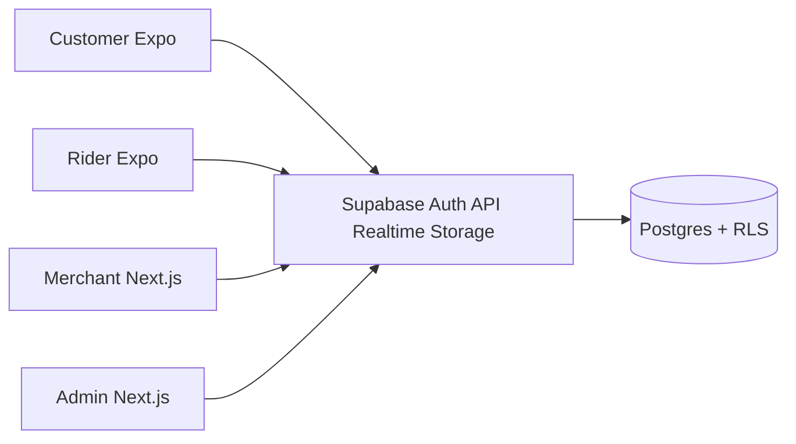

# Analysis & Design — Bolantero

**Version:** 1.1  
**Status:** Baselined (Phase 1 + Phase 2 trips)  

## 1. System context

## 2. Architectural style

- **Client-server** with BaaS (Supabase)
- **Modular monorepo** (apps + shared domain packages)
- **Security-by-default** via Postgres RLS
- **Eventual realtime UX** via Supabase Realtime on `orders` / `deliveries` / `trips`

## 3. Domain model (logical)

| Entity | Responsibility |
|--------|----------------|
| Profile | Role, verification level |
| VerificationSubmission | KYC workflow |
| Merchant / Product | Food catalog |
| Address / ServiceArea | Geo coverage |
| Order / OrderItem | Merchant sale (subtotal) |
| Delivery | Logistics assignment lifecycle |
| DeliveryFeeRule | Configurable pricing |
| Payment | Split payee: merchant vs platform |
| Rating | Post-delivery feedback |
| RiderPresence | Online dispatch eligibility |
| Trip | Merchant-less Ride or Padala booking |
| TripFareRule | Configurable ride/padala pricing |
| TripPayment | Split payee: platform vs rider (never merchant) |
| TripEvent | Status-change audit |

## 4. Key design decisions (ADRs)

### ADR-001 — Logistics-only revenue
- **Decision:** No commission columns or UI for product sales. Phase 2 trip fare is a platform-priced mobility/courier service, not a merchant sale.
- **Consequence:** Food platform revenue stays on `payments` (delivery/COD). Trip platform revenue stays on `trip_payments`. `orders.subtotal` is never skimmed.

### ADR-002 — Manual KYC review first
- **Decision:** Admin review queue instead of third-party KYC.
- **Consequence:** Faster MVP; replaceable later behind same submission table.

### ADR-003 — Order placement via RPC
- **Decision:** `place_order` security-definer function computes fees and writes order + delivery + payments atomically.
- **Consequence:** Clients cannot bypass money invariants easily.

### ADR-004 — Separate Expo apps for customer and rider
- **Decision:** Two mobile apps, not one role-switch app.
- **Consequence:** Clearer UX and store listing; shared packages reduce duplication.

### ADR-005 — Separate trips domain
- **Decision:** Ride and Padala use `trips` / `trip_payments` / `trip_fare_rules`, not `orders`.
- **Consequence:** Food stays merchant-bound. Clients cannot attach a trip fare to `orders.subtotal` or a merchant payee. Unused `delivery_type` values (`p2p`, `multi_stop`, …) stay unused.

### ADR-006 — Trip fare split
- **Decision:** Server computes fare (`quote_trip` / `request_trip`). `trips.fare = platform_fee + rider_earning`. Client cannot submit its own fare.
- **Consequence:** Same trust model as `place_order`. Rider share is the residual after the configured platform fee (basis points).

## 5. Critical flows

### 5.1 Verification
Register → OTP/email → upload docs → admin `review_verification` → level upgrade → Verified badge.

### 5.2 Order-to-delivery
Customer checkout → `place_order` → merchant confirm/ready → rider accept → status transitions → POD → complete → rating.

### 5.3 Ride / Padala
Customer picks service → pickup/dropoff in a launch area → `quote_trip` → `request_trip` → rider `accept_trip` → `advance_trip` (arrived_pickup → in_progress → completed). Customer may `cancel_trip` while `requested`.

## 6. Security design

- AuthN: Supabase Auth
- AuthZ: RLS + role checks in RPCs
- Storage: private buckets, folder = `user_id`
- Secrets: env files never committed

## 7. UI/UX design principles

- Brand: trusted local logistics (earth + deep green; Fraunces/Manrope)
- Customer/Rider: task-focused mobile flows
- Merchant/Admin: operational density over marketing chrome

## 8. Design change control

Any change that affects money split, verification gating, or service areas requires:
1. SRS update (`01-REQUIREMENTS.md`)
2. This design doc update
3. Migration plan if schema changes
4. Traceability + test updates
