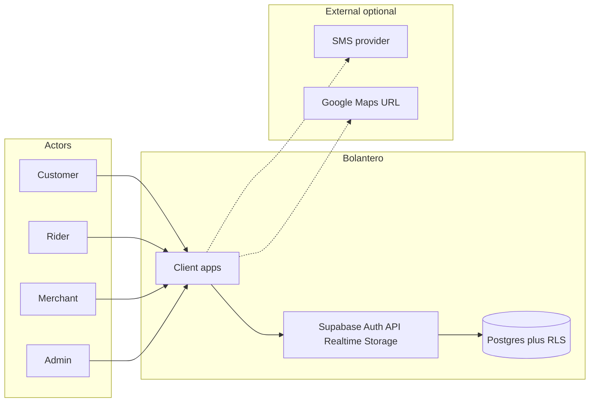
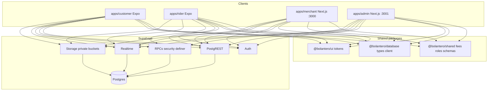
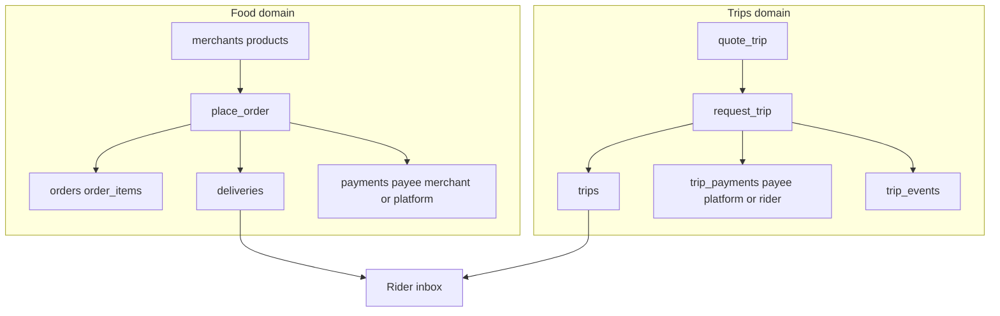
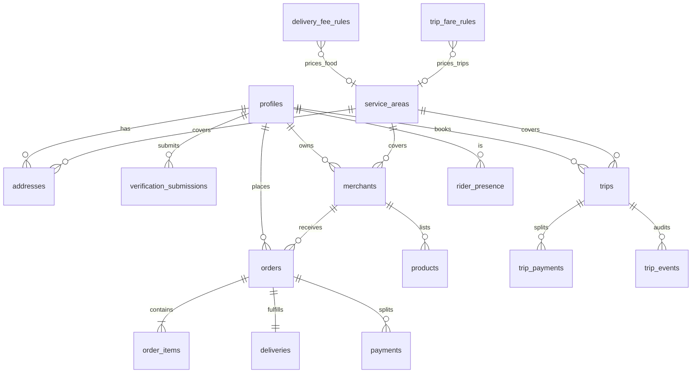
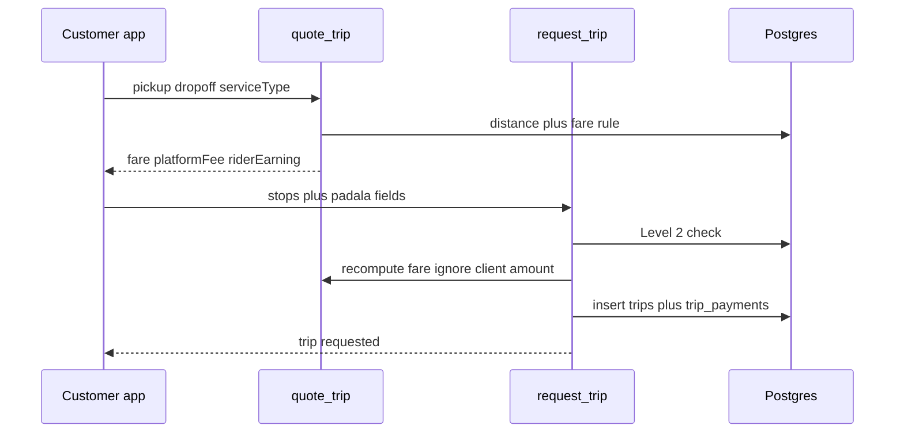
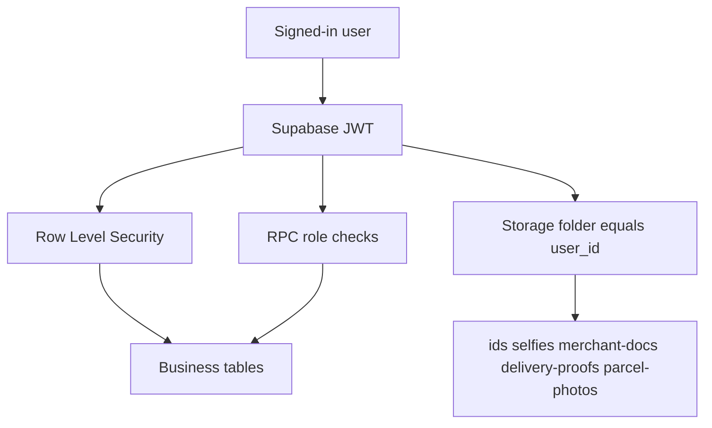
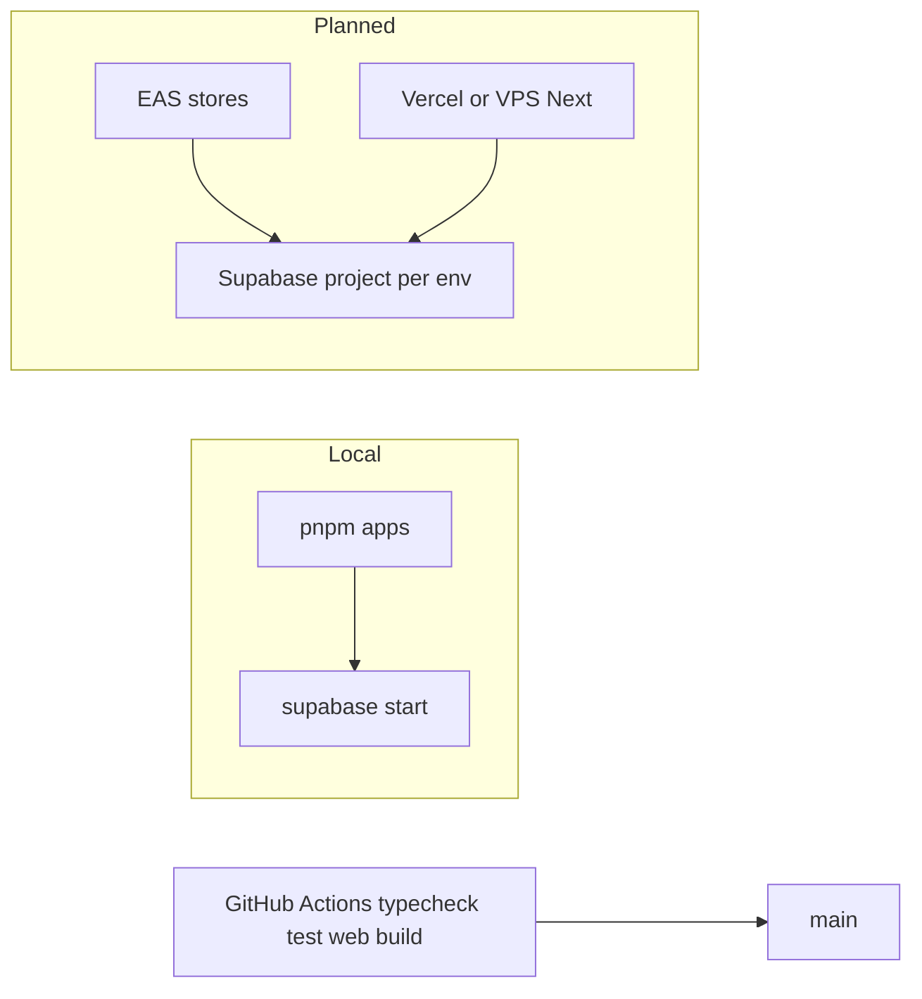

# Analysis & Design — Bolantero

**Version:** 1.2  
**Status:** Baselined (as-built Phase 1 food + Phase 2 Ride/Padala)  
**Scope:** Tacurong City, Lambayong, Isulan · motorcycle mobility + food logistics

This document is the system architecture. Implementation must match it. Money split, verification gates, and service-area rules cannot change without an SRS update and a new ADR.

## 1. Purpose and quality attributes

Bolantero is a **logistics and mobility operator**, not a marketplace that skims merchant sales. Customers book food delivery, motorcycle Ride, or Padala. Merchants sell food at 100% of `orders.subtotal`. Riders fulfill food jobs and trips. Admins verify identity and configure prices.

| Attribute | Architectural response |
|-----------|------------------------|
| Money integrity | Security-definer RPCs compute fees; DB constraints encode splits; food and trip money are separate tables |
| Identity trust | Verification levels 1–4 gate writes (`place_order`, `request_trip`, `accept_*`) |
| Least privilege | Postgres RLS on every business table; private Storage folders keyed by `user_id` |
| Operability | Admin portals + Realtime on `orders` / `deliveries` / `trips` |
| Change safety | Versioned SQL migrations only; shared TypeScript domain packages |

## 2. System context

Four human roles talk to one backend (Supabase). There is no custom application server. SMS OTP is optional (external when configured). Maps navigation is opened as an external URL, not an in-app engine.

Out of this architecture (later): cars/vans, auto-dispatch, PSP settlement, third-party KYC, in-app turn-by-turn.

## 3. Container architecture

| Container | Runtime | Responsibility |
|-----------|---------|----------------|
| Customer app | Expo / React Native | Service home (Ride, Padala, Food), book/track trips, food cart/checkout, KYC upload, activity |
| Rider app | Expo / React Native | Online presence, unified inbox, food + trip status machines, POD upload, earnings |
| Merchant portal | Next.js | Onboarding, products, incoming food orders, sales report (gross product, no commission) |
| Admin portal | Next.js | Verification queue, merchant approval, live deliveries, live trips, fee rules, reports |
| `@bolantero/shared` | TypeScript library | Pure fee math, trip fare math, roles, Zod schemas, status enums |
| `@bolantero/database` | TypeScript library | Typed Supabase client |
| `@bolantero/ui` | CSS/TS tokens | Brand color/type/radius |
| Supabase | Hosted/local BaaS | Auth, Postgres, RLS, RPCs, Realtime, Storage |

Clients may **preview** quotes in TypeScript. Authoritative money writes happen only in Postgres RPCs.

## 4. Dual domain: food vs trips

Food cannot share `orders` with Ride/Padala. `orders.merchant_id` and `orders.address_id` are required; line items come from `products`. Trips have no merchant.

| Concern | Food | Ride / Padala |
|---------|------|----------------|
| Aggregate | `orders` + `deliveries` | `trips` |
| Customer pays | subtotal + delivery + COD | `trips.fare` |
| Merchant | 100% of `orders.subtotal` | none |
| Platform | `delivery_fee` + `cod_fee` | `trips.platform_fee` |
| Rider | share of delivery fee (today 80%) | `fare − platform_fee` |
| Create RPC | `place_order` | `quote_trip` then `request_trip` |
| Accept RPC | `accept_delivery` | `accept_trip` |
| Payments table | `payments` (`merchant` \| `platform`) | `trip_payments` (`platform` \| `rider`) |

Unused `delivery_type` enum values (`p2p`, `multi_stop`, `bulk`, `corporate`) stay unused.

## 5. Logical data model

**Profiles** carry `role` and `verification_level` (1 Registered → 2 Customer → 3 Merchant → 4 Rider).

**Service areas** are circles (`center_lat/lng` + `radius_km`) for Tacurong, Lambayong, Isulan. Trip pickup must sit in the selected area; dropoff must sit in some active launch area.

**Food status machines**

- Order: `pending → confirmed → preparing → ready` (merchant), then delivery completion marks `completed`
- Delivery: `awaiting_rider → assigned → arrived_store → picked_up → delivered`

**Trip status machine** (Ride and Padala share it; Padala is labeled by `service_type`)

- `requested → accepted → arrived_pickup → in_progress → completed`
- Customer may cancel only while `requested`

## 6. Write-path and money architecture

Clients do not insert `orders`, `trips`, or payment rows directly (RLS `WITH CHECK (false)` on those inserts). Money functions run as `SECURITY DEFINER` and recompute fees from active rules.

Food `place_order` is the same pattern: verify Level 2, load merchant/products, haversine, apply `delivery_fee_rules`, write `orders` + `order_items` + `deliveries` + `payments`.

Invariants enforced in schema and RPC:

1. `orders.subtotal` is never reduced by a platform commission.
2. Food `payments.payee` is only `merchant` or `platform`.
3. `trips.fare = platform_fee + rider_earning`.
4. `trip_payments.payee` is only `platform` or `rider` (no merchant).

Shared TypeScript (`packages/shared/src/fees.ts`, `trip-fees.ts`) mirrors RPC math for UI quotes and unit tests. RPC remains source of truth.

## 7. Application component map

| App | Main surfaces | Primary RPCs / tables |
|-----|---------------|------------------------|
| Customer | `ServicesScreen`, `BookTripScreen`, `TripTrackScreen`, `ActivityScreen`, food `HomeScreen` / cart / orders, `VerifyScreen` | `quote_trip`, `request_trip`, `cancel_trip`, `place_order` |
| Rider | `JobsScreen` (filter All / Ride / Padala / Food), `EarningsScreen` | `accept_delivery`, `accept_trip`, `advance_trip`; `rider_presence`; Storage `delivery-proofs` |
| Merchant | onboarding, products, orders, reports | order status updates; product CRUD |
| Admin | verifications, merchants, deliveries, trips, fees, reports | `review_verification`; `delivery_fee_rules`; `trip_fare_rules` |

Realtime: customer/merchant/admin/rider subscribe to Postgres changes on `orders`, `deliveries`, and/or `trips`.

## 8. Security architecture

| Layer | Mechanism |
|-------|-----------|
| AuthN | Supabase Auth (email/password demo; phone OTP when SMS configured) |
| Session | Expo SecureStore (mobile); cookies (`@supabase/ssr`) on Next apps |
| AuthZ | `profiles.role`, `verification_level`, `is_admin()`, RLS |
| Money writes | Security-definer RPCs; no client-supplied fare/subtotal |
| Storage | Private buckets; object prefix = `auth.uid()` |
| Secrets | `.env` / `.env.local` uncommitted; service role only on seed/server |

KYC is **manual** (ADR-002): customer/merchant/rider upload docs; admin calls `review_verification`.

## 9. Deployment architecture (current + planned)

| Environment | Backend | Apps |
|-------------|---------|------|
| Local | Docker Supabase (`pnpm db:start`) | Expo + Next against `127.0.0.1:54321` |
| Staging / prod | Supabase project | Merchant/Admin web host; customer/rider EAS |

CI (`.github/workflows/ci.yml`) typechecks shared packages and web apps, runs unit tests, builds merchant and admin. Migrations apply via Supabase CLI, never by dashboard-only schema edits.

## 10. Key design decisions (ADRs)

### ADR-001 — Logistics-only revenue
- **Decision:** No commission columns or UI for product sales. Phase 2 trip fare is a platform-priced mobility/courier service, not a merchant sale.
- **Consequence:** Food platform revenue stays on `payments` (delivery/COD). Trip platform revenue stays on `trip_payments`. `orders.subtotal` is never skimmed.

### ADR-002 — Manual KYC review first
- **Decision:** Admin review queue instead of third-party KYC.
- **Consequence:** Faster MVP; replaceable later behind the same submission table.

### ADR-003 — Order placement via RPC
- **Decision:** `place_order` security-definer function computes fees and writes order + delivery + payments atomically.
- **Consequence:** Clients cannot bypass money invariants easily.

### ADR-004 — Separate Expo apps for customer and rider
- **Decision:** Two mobile apps, not one role-switch app.
- **Consequence:** Clearer UX and store listing; shared packages reduce duplication.

### ADR-005 — Separate trips domain
- **Decision:** Ride and Padala use `trips` / `trip_payments` / `trip_fare_rules`, not `orders`.
- **Consequence:** Food stays merchant-bound. Clients cannot attach a trip fare to `orders.subtotal` or a merchant payee.

### ADR-006 — Trip fare split
- **Decision:** Server computes fare (`quote_trip` / `request_trip`). `trips.fare = platform_fee + rider_earning`. Client cannot submit its own fare.
- **Consequence:** Same trust model as `place_order`. Rider share is the residual after the configured platform fee (basis points).

### ADR-007 — BaaS instead of a custom API server
- **Decision:** Expo and Next.js call Supabase Auth / PostgREST / RPCs / Realtime / Storage directly.
- **Consequence:** Operational simplicity for the SK launch; business rules that must not be bypassed live in Postgres, not in client code.

## 11. Critical flows

### 11.1 Verification
Register → OTP/email → upload docs → admin `review_verification` → level upgrade → **Bolantero Verified**.

### 11.2 Order-to-delivery
Customer Food tile → catalog → cart → `place_order` → merchant confirm/ready → rider `accept_delivery` → arrived / picked up / POD / delivered → rating.

### 11.3 Ride / Padala
Customer Ride or Padala → landmark pickup/dropoff in a launch area → `quote_trip` → `request_trip` → rider `accept_trip` → `advance_trip` (`arrived_pickup` → `in_progress` → `completed`). Customer may `cancel_trip` while `requested`.

## 12. UI/UX design principles

- Brand: trusted local logistics (earth + deep green; Fraunces/Manrope)
- Customer/Rider: task-focused mobile flows; customer default home is Ride/Padala, Food is a secondary tile
- Merchant/Admin: operational density over marketing chrome
- Pickup/dropoff for this slice: saved addresses + landmarks (map pin UX is a follow-on)

## 13. Design change control

Any change that affects money split, verification gating, or service areas requires:
1. SRS update (`01-REQUIREMENTS.md`)
2. This design doc update (ADR if the decision is durable)
3. Migration plan if schema changes
4. Traceability + test updates
